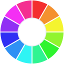

<p align="center">
   <a href="https://codigrate.com/tools/color">
      
   </a>
</p>

<h1 align="center">
Color Picker by Codigrate
</h1>

<p align="center">
A complete color companion for your JetBrains IDE. Pick any color on your screen with the eyedropper, then read everything about it in one tool window: conversions across every common color space, WCAG accessibility checks, harmony schemes, tint and shade ramps and color temperature.
</p>

## Features

- **Eyedrop anywhere.** Sample any pixel on your screen: your code, a design tool, an image, anything you can see.
- **Conversions.** Hex, RGB, RGB %, Web-Safe, Decimal, Octal, Binary, HSL, HSV, HWB, OKLCH, OKLab, CIE-LAB, CIE-LCH, CMYK, nearest RAL Classic, XYZ, Yxy and Hunter Lab, each one click to copy.
- **Copy-ready CSS.** The color as text, background, border, text shadow and box shadow rules.
- **Accessibility.** WCAG 2 contrast ratio and APCA (WCAG 3) of the color as text on white, black and its complementary, both directions, with AA and AAA verdicts for normal and large text.
- **Color channels.** The screen (RGB, HSL, HSV) and print (CMYK) channel mix as bars.
- **Harmony.** Complementary, analogous, monochrome, split complementary, triadic and tetradic companions from the color wheel, one click away.
- **Tints, shades and tones.** The color stepped toward white, black and gray; click a step to load it.
- **Temperature.** Whether the color reads warm or cool, with its warmer and cooler neighbours.
- **Color vision deficiency.** The color beside its simulation under protan, deutan, tritan and monochromacy vision, from mild to severe.
- **Recent colors.** Your last picks stay in the tool window, so the shades you are working with are always one click away.
- **Explore in Codigrate.** Send any color to the [Codigrate color tool](https://codigrate.com/tools/color) for palettes, matching IDE themes and more.

Sections are collapsible and the tool window remembers which ones you keep open. The conversion math is shared with the Codigrate color tool, so values match the website exactly.

## Getting Started

1. Install **Color Picker by Codigrate** from the JetBrains Marketplace.
2. Open the **Color Picker** tool window (right sidebar), or run **Tools | Pick a Color**.
3. Press **Pick a Color** and use the eyedropper to sample any pixel.
4. Click the HEX, RGB or HSL row to copy that value.

## Develop

```bash
./gradlew runIde        # sandbox IDE with the plugin installed
./gradlew buildPlugin   # distributable zip in build/distributions
./gradlew verifyPlugin  # JetBrains Plugin Verifier
```

The build compiles against a locally installed IDE when `localIdePath` in `gradle.properties` exists; otherwise it downloads IntelliJ IDEA Community.

## Structure

| Path | Purpose |
|---|---|
| `src/main/java/com/codigrate/colorpicker/` | tool window UI, picker action, persisted history |
| `src/main/resources/META-INF/plugin.xml` | plugin manifest |
| `src/main/resources/icons/` | tool window and pipette icons |

---

<p align="center">
Part of the Codigrate tools family, alongside the in-browser
<a href="https://codigrate.com/tools/color">color</a>,
<a href="https://codigrate.com/tools/palette">palette</a> and
<a href="https://codigrate.com/tools/gradient">gradient</a> tools.
</p>

## Contributing

Issues and suggestions are welcome. Open an issue on this repository, or reach us at [info@codigrate.com](mailto:info@codigrate.com).

## Contributors

<a href="https://github.com/codigrate/jetbrains-color-picker/graphs/contributors">
   
</a>

## License

The source code for this project is released under the [MIT License](LICENSE).

## Codigrate

Themes, color tools and developer experience products from [Codigrate](https://codigrate.com).

<p align="center">
   <a href="https://codigrate.com/themes">All Themes</a> ·
   <a href="https://codigrate.com/tools">Color Tools</a> ·
   <a href="https://codigrate.com/plugins">Plugins</a> ·
   <a href="https://codigrate.com/blog">Blog</a> ·
   <a href="https://github.com/codigrate">GitHub</a>
</p>

<table align="right"><tr><td><a href="https://codigrate.com"></a></td><td><b>Codigrate © 2026</b></td></tr></table>
